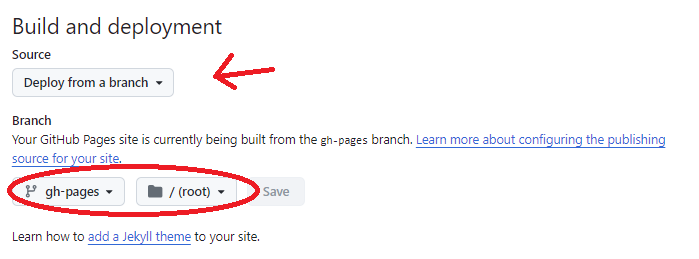

# docs-template

## Getting Started

Follow these steps to quickly start working on this project:

1. **Fork the Repository**:
   - Start by [forking this repository](https://github.com/AJLab-GH/docs-templates/fork)
     to your own GitHub account.

2. **Clone the Repository**:

   - Clone the forked repository to your local machine:

     ```bash
     git clone https://github.com/YOUR_USERNAME/docs-templates.git
     cd docs-templates
     ```

3. **Configure your GitHub Pages**:
   - In your `docs-templates` repository settings, navigate
     to `Actions -> Pages` and ensure to set your `Build and Deployment`
     `source` to **Deploy from a branch** and your `branch`to **gh-pages**
     in the **/(root)** folder. Finally, `save` your changes.

   

4. **Configure Gist**:

   - Click the **Settings** gear next to the **About** section

     

   - Check `Use your GitHub Pages Website`, and Click `save your changes`.

     

5. **Customize your Markdown File(s)**:
   - In this template example, the `actions` and `pages` are configured to use
     your **README.md** file.
     - Open `README.md`.
     - Make your changes

   - After making these changes, commit and push the updated workflow file:

     ```bash
     git add .
     git commit -m "<depict the changes you made>"
     git push origin main
     ```

**Workflow:**

The Workflow consists of five stages:

1. **Checkout Repository**: The latest version of our repository is
checked out using the `actions/checkout` action.
1. **Configure GitHub Pages**: This stage sets up GitHub Pages to deploy
our documentation.
1. **Install Python and MkDocs software**: Python 3.x is installed,
followed by a list of MkDocs plugins required for building and deploying
our documentation.
1. **Build Docs**: The `mkdocs gh-deploy` command is run to build and
deploy our documentation to GitHub Pages.
1. **Triggering the workflow:**
The workflow is triggered automatically whenever changes are pushed to the
`main` branch or when a pull request is created. This ensures that our
documentation is always up-to-date and reflects the latest changes in our
codebase.

**Concurrent builds:**
To ensure that only one build is running at a time, we use GitHub Actions'
concurrency feature. If multiple pushes occur simultaneously, the workflow
will wait for the previous build to complete before starting a new one.

**Permissions:**
The workflow has write permissions to the `contents`, `pages`, and
`id-token` of our repository, allowing it to create and update files as
needed.

By using GitHub Actions to automate our documentation build and deployment
process, we can ensure that our documentation is always up-to-date,
reliable, and easily accessible.
